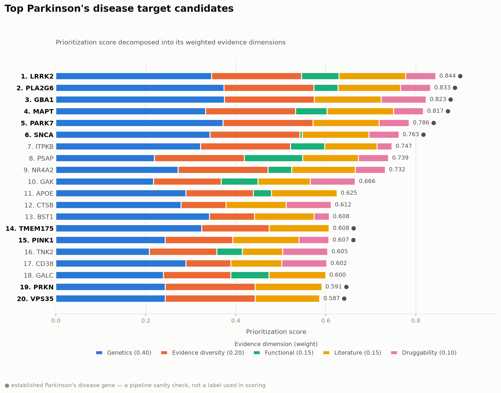
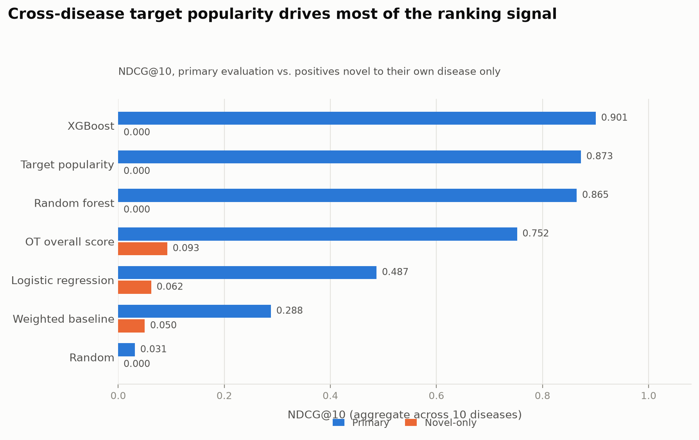

# Disease–Target Prioritization

Ranks candidate therapeutic targets for a disease by integrating public biomedical
evidence — human genetics, pathways, tissue expression, protein networks and
tractability — and explains why each target scored the way it did.

> **This is a research-support and learning prototype.** Scores are prioritization
> hypotheses generated from public databases, not validated scientific findings.
> A high score does not mean a target will yield an effective drug. Not for medical
> diagnosis or treatment decisions. See [docs/limitations.md](docs/limitations.md).

Specification: [Context.md](Context.md) and [Project_info.md](Project_info.md).

## Status

| Phase | State |
| --- | --- |
| Data acquisition & repository scaffolding | **Done** |
| Milestone 1 — Parkinson's rule-based baseline (Context §36) | **Done** — [implementation record](milestone1.md) |
| Milestone 2 — multi-disease ML baseline (Context §37) | **Done** — [implementation record](milestone2.md), [full report](reports/evaluation/baseline_report.md) |
| Milestone 3 — Streamlit app (Context §21) | **Done** — [implementation record](milestone3.md) |
| Milestone 4 — Reactome/GTEx/STRING integration, FastAPI `/rank` (Context §28 Step 9) | **Done** — [implementation record](milestone4.md) |

Implemented and tested: configuration, path and provenance utilities, the dataset
downloader, identifier normalization, the leakage guard, the Open Targets readers,
the genetics and druggability feature groups, the weighted baseline with
per-dimension explanations and ablation, report and figure generation, multi-disease
label construction, the multi-disease feature table, leave-one-disease-out
evaluation with ranking metrics, logistic regression / random forest / XGBoost
training, non-learned comparison baselines, SHAP explanations, held-out
per-disease fold models, the disease search / target ranking / evidence-card
services, the three-page Streamlit app, Reactome/GTEx/STRING pathway/expression/
network features, and the FastAPI `/rank` endpoint.
430 tests.

No stubs remain. `features/pathways.py`, `expression.py` and `network.py` (Context
§28 Step 9) and `api/main.py`'s `/rank` were the last four — see
[milestone4.md](milestone4.md) for what was built, what was deliberately deferred
(four columns needing a "known disease genes" seed set this repo has no
leakage-reviewed definition for), and a real gap Milestone 4 discovered along the
way (GTEx has no synovial-tissue data at all, affecting rheumatoid arthritis).

## Milestone 1 — the Parkinson's baseline

A transparent weighted sum over the 8,690 targets Open Targets 26.06 associates
with Parkinson's disease (`MONDO_0005180`). No machine learning, on purpose: the
weights are hand-set and the arithmetic is inspectable, so if established genes
surface near the top then the data pipeline is sound. A gradient-boosted model
failing the same way would say nothing about where the fault was.

```
score = 0.40 · genetics  +  0.20 · evidence_diversity  +  0.15 · functional
      + 0.15 · literature  +  0.10 · druggability
```

Weights live in [configs/model.yaml](configs/model.yaml) and the
dimension-to-datasource mapping in [configs/features.yaml](configs/features.yaml),
so someone who knows the biology but not Python can review it. Within a dimension
the score is the *maximum* across its datasources — a target is as good as its
best evidence of that kind, and averaging would penalise a gene for the
datasources that simply have not studied it.

Three measurements shaped that formula. **6,196 of the 8,690 candidates (71%) have
literature evidence and nothing else**, so a naive score would rank genes by how
often they are written about. **The established genes carry the most distinct
evidence types of any candidate** (LRRK2 seven, GBA1 and SNCA six), which is why
diversity became a scored dimension rather than a reported statistic. And **Open
Targets holds no pathway evidence for this disease at all** — its `reactome`
datasource has zero rows — so the pathway term in the §17.1 example formula was
not merely deferred, it was impossible.

### Result, with the caveat attached

All five established Parkinson's genes reach the top 20. Only three survive the
literature ablation (Context §32.2), and that is the number that qualifies the
headline:

| Gene | Rank | Rank without literature |
| --- | ---: | ---: |
| LRRK2 | 1 | 1 |
| GBA1 | 3 | 3 |
| SNCA | 6 | 8 |
| PINK1 | 15 | **24** |
| PRKN | 19 | **28** |

Nothing in the scoring knows these five genes. The ranking also surfaced PLA2G6
(#2, PARK14), MAPT (#4), PARK7 (#5, DJ-1) and VPS35 (#20, PARK17) unprompted.



Segment lengths are the weighted contributions and sum exactly to the score. A
missing segment is missing evidence, not zero evidence.

The ablation means this method **cannot distinguish a gene that is well-published
because it matters from one that merely appears in many abstracts** — and the 71%
of candidates carrying literature alone are exactly where that bites. LRRK2,
PLA2G6, GBA1, MAPT and PARK7 do not move at all when literature is dropped; those
are the targets this baseline supports on genetics and functional evidence
standing alone.

Two more things a passing acceptance check invites over-reading. There are no
labels and no held-out set here, so "5 of 5 in the top 20" is a sanity check and
not a measured performance figure. And the candidates are targets Open Targets
*already* associates with Parkinson's, so the method re-ranks known associations
by construction (§13) — it cannot discover anything new.

Deliverables, all committed so the results can be read without downloading
anything:

| Path | What it is |
| --- | --- |
| [reports/parkinsons_baseline_report.md](reports/parkinsons_baseline_report.md) | Findings, manual inspection of the top 10, ablation, eight limitations |
| [data/processed/parkinsons_targets.parquet](data/processed/) | 8,690 ranked candidates with per-dimension contributions, plus a `.provenance.json` sidecar |
| [reports/figures/parkinsons_top_targets.png](reports/figures/parkinsons_top_targets.png) | The figure above |
| [notebooks/01_parkinsons_open_targets.ipynb](notebooks/01_parkinsons_open_targets.ipynb) | Executable walkthrough; outputs are stripped by `nbstripout`, so run it to regenerate |

The report is generated rather than hand-written, so its prose cannot drift from
the numbers it describes. The one hand-written part — the per-gene notes for the
top 10 — is marked as such, because whether a gene is genuinely established or
merely well-published is a judgement no script should make.

Full implementation record, including the three silent bugs this milestone
surfaced: [milestone1.md](milestone1.md).

## Milestone 2 — the multi-disease ML baseline, and its headline caveat

Expands Milestone 1 to all ten configured diseases (89,666 candidate rows,
2,233 positives at 2.49% prevalence), trains logistic regression, random
forest and XGBoost under leave-one-disease-out, and compares them against
four non-learned baselines — including one, `target_popularity`, built
specifically to test a hypothesis this milestone's own label measurement
raised before any model was trained: **78–98% of every disease's positives
are also positives in at least one other configured disease** (each shared
target counted once per disease; counted once overall instead, it's 65% —
see [milestone2.md §1](milestone2.md)), so a model
could rank well purely by learning "this is a druggable, well-precedented
target" without any disease-specific signal at all.

That is exactly what happened:

| Method | NDCG@10 (primary) | NDCG@10 (novel-only) |
| --- | ---: | ---: |
| Target popularity | **0.873** | 0.000 |
| OT overall score | 0.752 | 0.093 |
| XGBoost | 0.696 | 0.009 |
| Random forest | 0.529 | 0.000 |
| Logistic regression | 0.501 | 0.067 |
| Weighted baseline | 0.288 | 0.050 |
| Random | 0.031 | 0.000 |



`target_popularity` — a baseline with no learning at all, just a count of
how many *other* diseases a target is a positive in — outranks every
trained model, including XGBoost. Restricting evaluation to positives that
don't recur across diseases (`novel_only_labels`) collapses every method's
NDCG@10 toward zero; XGBoost falls from 0.696 to 0.009. On the evidence
measured here, the ML models learned mostly cross-disease target popularity,
not disease-specific biology — reported as the milestone's headline
finding, not smoothed into a footnote.

The acceptance check that does gate the pipeline (every method beats
`random_ranking` on NDCG@10 in ≥ 9/10 diseases) passed for all six
non-random methods. A second candidate check — XGBoost ≥ logistic
regression ≥ weighted baseline — was deliberately *not* made an exit-code
condition, because enforcing it would have hidden the result above.

| Path | What it is |
| --- | --- |
| [reports/evaluation/baseline_report.md](reports/evaluation/baseline_report.md) | Full findings: per-disease breakdown, literature ablation, limitations |
| [data/processed/disease_target_features.parquet](data/processed/) | Multi-disease feature table, 89,666 rows |
| [data/processed/labels.parquet](data/processed/) | Labels + per-disease provenance |
| [models/trained/xgboost_baseline.json](models/trained/) | Final XGBoost model, refit on all 10 diseases |
| [reports/evaluation/baseline_metrics.json](reports/evaluation/baseline_metrics.json) | Every metric, every method, per-disease and aggregate |
| [docs/model_card.md](docs/model_card.md) | Model card for the XGBoost deliverable |

Reproduce with `uv run python scripts/train_model.py` (data + labels +
training) and `uv run python scripts/evaluate_model.py` (adds the figure and
report) — both exit non-zero if the acceptance check fails. Determinism
verified by diffing `baseline_metrics.json` across two full runs
(byte-identical), the same standard Milestone 1 held itself to.

Full implementation record, including the label-construction gaps found
while building this and the two silent bugs the real 10-fold run surfaced:
[milestone2.md](milestone2.md).

## Milestone 3 — the Streamlit app, and why it shows two scores

A disease search, a ranked target table with the buildable §21/§38 filters,
and a target evidence page combining the weighted baseline's exact
per-dimension breakdown with the held-out XGBoost model's live SHAP
explanation. Built directly on Milestone 2's headline finding rather than
around it: **the app shows the weighted-baseline score by default and the
XGBoost score alongside it, never one in place of the other**, because
Milestone 2 measured that XGBoost's ranking quality is mostly cross-disease
target popularity (novel-only NDCG@10 0.009) while the weighted baseline is
weaker overall (0.288) but fully transparent. Picking one would have
required either hiding the caveat or hiding the stronger model.

Three design decisions this milestone had to make, each because Milestone 2
made the naive version wrong or impossible:

**The XGBoost score shown is scored by the model that never saw that
disease.** `models/trained/xgboost_baseline.json` — Milestone 2's deliverable
— is refit on all ten diseases, so its predictions on any of them are
in-sample. The app instead persists all ten leave-one-disease-out fold models
(`models/trained/folds/`) and scores each disease with the one that excluded
it, so the number on screen matches what `baseline_metrics.json`'s
leave-one-disease-out numbers actually measured. Verified two ways in
`scripts/check_app.py`: the displayed score matches a fresh score from that
disease's fold model, *and* differs from what the all-disease refit would
have produced.

**Roughly a third of Context §21/§38's specified interface could not be built
at the time this milestone shipped.** Pathway, expression and network
evidence needed Reactome, GTEx and STRING — downloaded and validated
(Milestone 1) but not yet integrated into the feature pipeline (Context §28
Step 9) — so every such element rendered an explicit "not yet integrated"
placeholder rather than a blank cell inviting "assessed and found absent,"
and the relevant-tissue and target-family filters raised rather than
silently doing nothing. Milestone 4 closed the Reactome/GTEx/STRING gap and
the relevant-tissue filter now works; target-family remains unbuildable
(needs `target.targetClass`, unrelated to those three sources) — see
[milestone4.md](milestone4.md).

**A label-derived column must never reach a model, and the app is a new path
to the same parquet that could let one leak in.** The clinical-trial and
existing-drug fields Context §21/§38 ask for displayed *are* the training
label. `services/target_ranking.py` scores on feature columns only and joins
the display columns in strictly afterward — never before — and
`scripts/check_app.py` asserts this by patching the scoring call and
recording exactly what it was handed, on every run, against the real
pipeline. The two per-target things label evidence *is* good for — an
existing-drug summary and a "positive for N other configured diseases"
badge, the concrete per-target form of Milestone 2's popularity finding — are
shown on the evidence page, explicitly labelled as the training label rather
than as ranking evidence.

```bash
uv run python scripts/build_app_data.py   # after scripts/train_model.py
uv run python scripts/check_app.py        # acceptance check, exits non-zero on failure
uv run python scripts/run_app.py          # or: make app
```

Full implementation record, including a pyarrow/mimalloc segfault only the
real running app surfaced and a missing dataclass field no unit test caught:
[milestone3.md](milestone3.md).

## Quick start

```bash
uv venv --python 3.11
uv pip install -e ".[dev]"
```

> **macOS: XGBoost and LightGBM need OpenMP.** `libxgboost.dylib` and
> `liblightgbm.dylib` both link against `libomp`, which Homebrew's Python
> does not ship. `brew install libomp` before Milestone 2 training —
> `import xgboost` raises `XGBoostError` without it.

> **`uv run` currently fails on this project.** Its automatic sync re-resolves the
> dependency set and picks a numba that will not build on Python 3.11. Add
> `--no-sync` to every `uv run` below to use the environment just installed —
> verified working. `uv pip compile` resolves the same `pyproject.toml` cleanly, so
> the fault is in the sync resolution rather than the pins.

```bash
# See what would be downloaded (nothing is written)
uv run python scripts/download_data.py --profile core --dry-run

# Fetch the datasets (~3.0 GB, checksums verified against upstream)
uv run python scripts/download_data.py --profile core

# Resolve disease names to Open Targets IDs and write them into the config
uv run python scripts/resolve_diseases.py

# Confirm every source parses and every identifier join connects
uv run python scripts/validate_data.py

uv run pytest -q
```

Then reproduce Milestone 1 — around a second each, both deterministic:

```bash
# The ranked parquet. --disease <key> for any disease in configs/diseases.yaml
uv run python scripts/build_dataset.py

# Figure + report. Exits non-zero if the acceptance check fails
uv run python scripts/run_milestone1.py
```

Determinism was verified by hashing the parquet across consecutive runs rather
than assumed — ties break on score, then gene symbol, then `target_id`, which is
the only one of the three that is unique. The single field that legitimately
changes between runs is `extraction_date`, which is the point of it.

Then Milestone 2 — around 90 seconds, ten leave-one-disease-out folds each
training logistic regression, random forest and XGBoost:

```bash
# Multi-disease features + labels + LODO training + metrics.
# Exits non-zero if the acceptance check fails
uv run python scripts/train_model.py

# Adds the figure and reports/evaluation/baseline_report.md
uv run python scripts/evaluate_model.py
```

Determinism verified the same way — `reports/evaluation/baseline_metrics.json`
diffed byte-identical across two full runs, after rounding metric values to
10 decimal places to absorb ~1-part-in-10¹⁶ floating-point noise from
`sklearn.metrics`' internal summation order under multi-threaded BLAS.

Then Milestone 3 — the app-facing precompute, the acceptance check, and the
app itself:

```bash
# Held-out scores, popularity badges, disease/target/drug metadata
uv run python scripts/build_app_data.py

# Six checks against the real pipeline. Exits non-zero if any fails
uv run python scripts/check_app.py

# Launches the app (checks required artifacts exist first)
uv run python scripts/run_app.py
# or: make app
```

`make help` lists shortcuts for the setup, download and validation steps above. The
Milestone 1 and Milestone 2 scripts have no Make target; `make app` runs
`scripts/run_app.py`.

## Data

Pinned to **Open Targets release 26.06**. Every downloaded file gets a
`*.manifest.json` sidecar recording URL, size, SHA-256, fetch timestamp, release
tag and licence; Open Targets files are additionally verified against the SHA-1
manifest published with the release.

| Source | Role | Size |
| --- | --- | ---: |
| Open Targets 26.06 | Associations, targets, diseases, drugs, tractability | 2.4 GB |
| STRING v12 | Protein–protein interactions | 100 MB |
| HGNC | Gene symbols, including retired ones | 16 MB |
| Reactome | Pathways | 483 MB |
| GTEx v10 | Tissue expression | 8 MB |

Measured totals from the 26.06 pull: **3.0 GB across 50 files**.

`--profile full` adds bulk expression and literature evidence (~15 GB total).
Those are excluded from `core` because their signal already arrives through the
per-datasource association scores, at a fraction of the size.

Verified after download: 78,691 targets, 47,080 diseases, 7,842,921 association
rows; all 10 configured diseases resolve and have candidate targets.

Milestone 1 uses Open Targets alone. STRING, Reactome and GTEx are downloaded and
validated but unused until Context §28 Step 9.

## Two things worth knowing before extending this

**1. The label is in the features unless you stop it.**

The MVP label is "target of an approved or clinically-advanced drug for this
disease" (Context §15), built from `clinical_target`. The `clinical_precedence`
datasource inside `association_by_datasource_direct` is *the same evidence* —
measured against release 26.06, all 107,593 of its (disease, target) pairs are
also label pairs. Training on it produces a model that reproduces its own target
variable and reports excellent metrics.

`configs/features.yaml` denylists it and `drop_denylisted_datasources` removes it
before any feature is computed, which also drops the 37 Parkinson's candidates
whose only evidence it was — that is why 8,727 candidates become 8,690 scored
rows.

**The second half of that defence was failing open, and only a probe found it.**
The final assertion selected candidate columns by prefix (`assoc_ds__`, `dim__`,
`prio__`), and two of the three matched nothing this pipeline actually produces:
it was inspecting 5 columns while logging a confident `leakage_guard_passed`.
Adding `maxClinicalStage` — the exact column the denylist exists to block — put it
in the output parquet *with values*, guard silent. Fixed two ways: prioritisation
fields are renamed to `prio__snake_case` on load so the patterns and the produced
column names actually meet, and the assertion now checks every column not on a
small allowlist of non-features. An allowlist of non-features fails closed; a
whitelist of feature prefixes fails open on any name nobody anticipated. The probe
now raises, and a normal run checks 18 columns rather than 5.

Liveness is checked as well, but against what the sources *could* produce before
filtering — "does the evidence this rule blocks still exist upstream?" rather than
"did we build it?", which is the version that does not fire on a correctly-working
pipeline. An upstream rename is exactly how a guard silently stops guarding, and
that has already happened once: releases before 26.06 called this datasource
`chembl`.

Nothing ever leaked — `drop_denylisted_datasources` and the config-load validator
were doing real work the whole time. But the layer being described as the other
half of a defence-in-depth pair was doing nothing. A guard that has never been
shown to fire is not known to work.

**2. Identifiers are where the silent failures live.**

Project_info.md §1.2 gives `EFO_0000384` for Crohn's disease. That ID does not
exist in release 26.06 — Open Targets migrated it to `MONDO_0005011`. Hard-coding
it yields zero targets, which reads as a modelling problem rather than an
identifier problem.

So IDs are resolved from the pinned release by `scripts/resolve_diseases.py`, never
transcribed. Three more traps, each with tests in `tests/test_identifiers.py`:
GTEx ships versioned gene IDs (`ENSG00000186092.7`), STRING keys on protein IDs
rather than gene IDs, and Reactome's mapping file is multi-species — the human
filter drops 95% of its rows.

Gene symbols are not unique either, which is a reproducibility problem rather than
a join problem: release 26.06 has two `calpastatin` entries with different Ensembl
IDs, so sorting on symbol alone left tied rows in whatever order DuckDB's parallel
scan happened to return.

## Layout

```
configs/     data_sources, diseases, features (+ leakage denylist), model
data/        raw (immutable) → interim → processed
src/target_prioritization/
  config.py     pydantic-validated config loading
  data/         download, identifiers, per-source readers, labels.py (multi-disease labels)
  features/     feature groups + the leakage guard
  models/       baseline, train, predict, evaluate, explain, baselines (non-learned)
  milestone1.py Milestone 1 orchestration, acceptance check, ablation
  milestone2.py Milestone 2 orchestration, LODO loop, acceptance check, leakage probe
  app_data.py   Milestone 3 app-facing precompute (held-out scores, popularity badge, metadata)
  app_checks.py Milestone 3/4 acceptance checks (leakage boundary, fold routing, placeholders)
  reporting.py  Milestone 1 report generation + the hand-written gene notes
  reporting2.py Milestone 2 report generation
  viz.py        evidence-breakdown + popularity-comparison figures + evidence radar
  services/     disease_search, target_ranking (score-first-join-second), evidence_summary
  api/          FastAPI — /rank implemented on top of services/target_ranking (Milestone 4)
app/         Streamlit — streamlit_app.py, common.py (shared state/caching), pages/
scripts/     download_data, resolve_diseases, validate_data, build_dataset, run_milestone1,
             train_model, evaluate_model, build_app_data, check_app, run_app,
             compare_baseline_weights, …
reports/     generated reports + figures
docs/        data dictionary, model card, dataset card, limitations, glossary
```

## Development

```bash
uv run ruff check . && uv run mypy src && uv run pytest -q
uv run pre-commit install
```

`make check` runs the same three.

## Licence

Code: see [LICENSE](LICENSE). Data retains its upstream licence — Open Targets and
Reactome CC0 1.0, STRING CC BY 4.0, HGNC public domain, GTEx under the GTEx Portal
terms. Each is recorded per file in the manifests.
